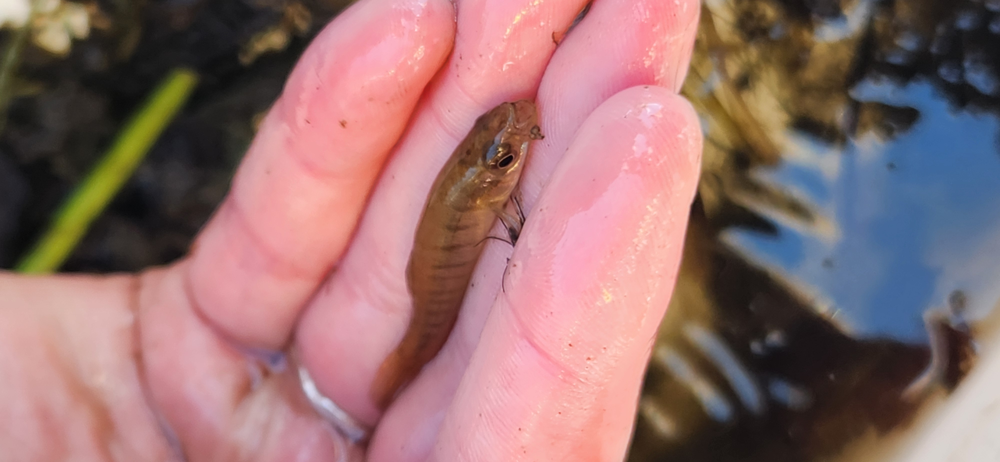
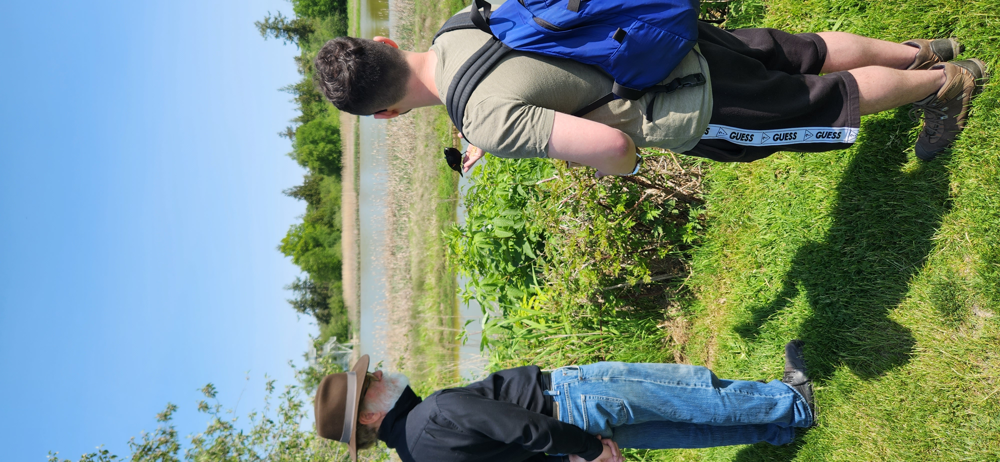
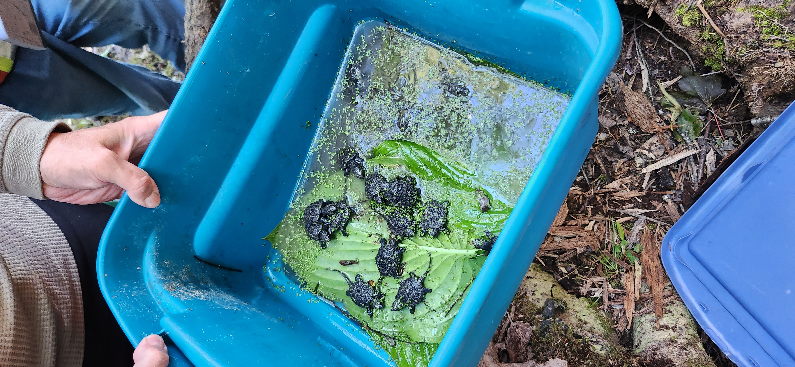

A selection of photos from my work in the field in both British Columbia and Nova Scotia. My field work has included extensive backcountry hiking, species identifiaction, teaching field methods, and benthic collection using the Cabin Kick protocol. I have worked in the field in the capacity of researcher, teacher and student.  
```{r, echo=FALSE,out.width="40%", out.height="20%",fig.show='hold',fig.align='center'}
knitr::include_graphics(c("images/sadie_kicknet.jpg", "images/fry_in_hand.jpg"))
knitr::include_graphics(c("images/sunshinecoast_trail.jpg", "images/papa_and_cary.jpg"))
#
knitr::include_graphics(c("images/abby_kicknet.jpg"))
knitr::include_graphics(c("images/green_snakes.jpg","images/turtle_babies.jpg"))
#
#
```
